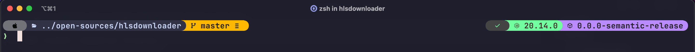

# Nur Rony's Dotfiles

My dotfiles :smile: for Zsh on **MacOS**. Clone the repository and Run `setup.sh` to setup some initial requirements

My most favourite parts are `.functions` and `.dockerfunctions`

### Installation

To get all done in a minutes you can use the [setup script](https://github.com/nmrony/dotfiles/blob/master/setup) script

```sh
curl -s https://raw.githubusercontent.com/nmrony/dotfiles/master/setup | bash
```

### Customization

Do not forget to edit git username and email in `.extra` and `.gitconfig` with yours.

**Happy Hacking!!**

### Developers macOS defaults (?) :wink:

When setting up a new Mac, you may want to set some sensible macOS defaults:

```sh
./.macos
```

### Install Homebrew formulae

When setting up a new Mac, you may want to install some common Homebrew formulae (after installing Homebrew, of course):

```sh
./brew.sh
```

### Terminal theme and tweaks

<p align="center">
 
</p>

I use **iTerm2** and **Zsh** together and **[PowerLevel10k][1]** as theme.
You need to install these followings to get look like my terminal theme

1. [Shade of Purple for iTerm2][2]
1. [MesloLGS NF Regular][3] - Font size: 15

You can import my settings from [iterm2][4] directory

### Special thanks to

- [Mathias Bynens](https://twitter.com/mathias)
- [Jess Frazelle](https://twitter.com/jessfraz)
- [Paul Irish](https://twitter.com/paul_irish)
- [Roman Perepelitsa][1] for PowerLevel10k theme

[1]: https://github.com/romkatv/powerlevel10k
[2]: https://github.com/ahmadawais/Shades-of-Purple-iTerm2
[3]: fonts/
[4]: iterm2/
